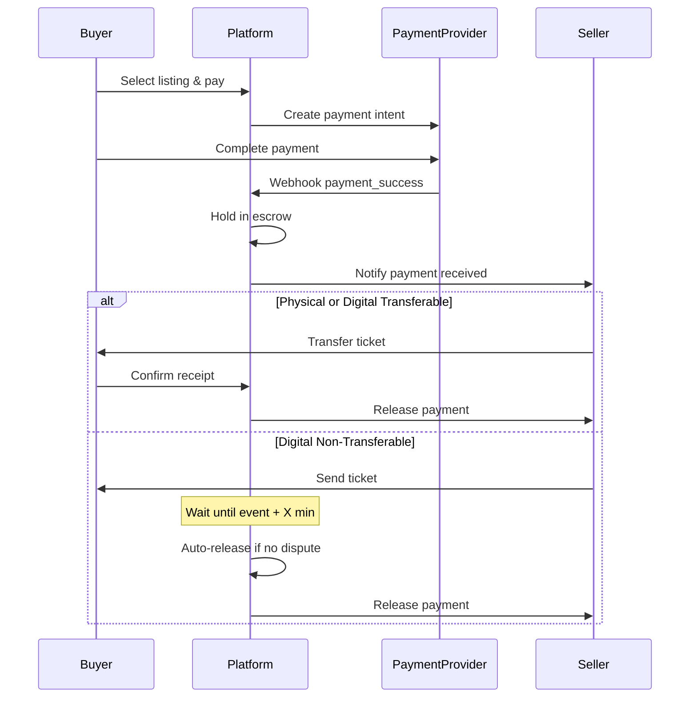
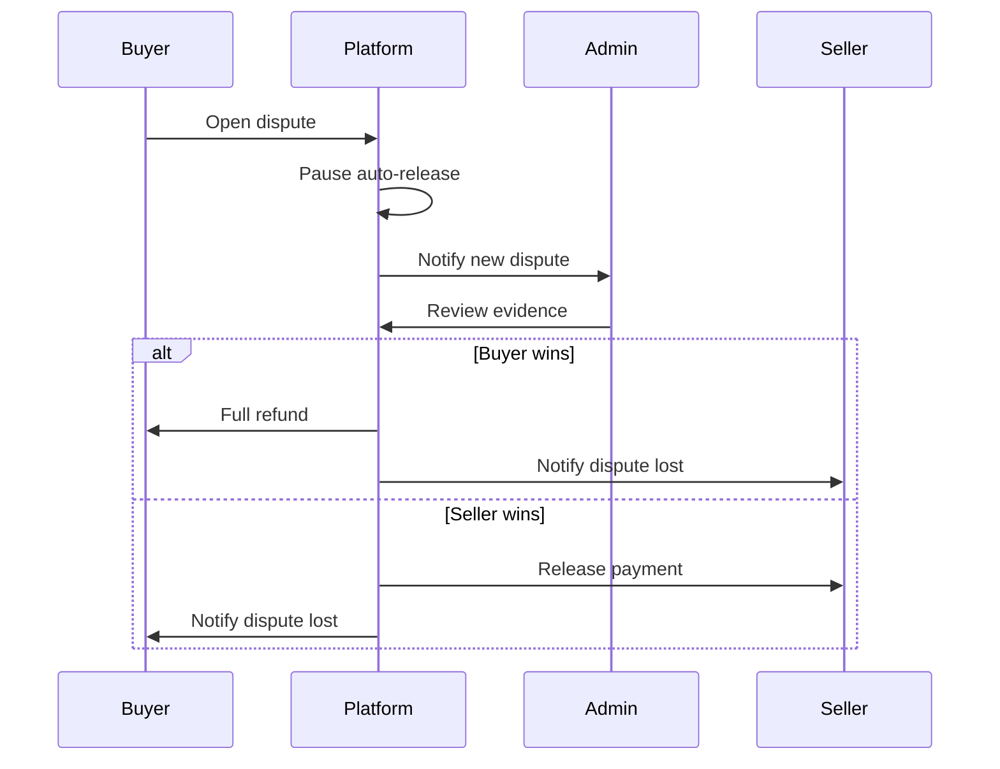

# TicketsHub - Sistema de Reventa de Tickets

## Arquitectura General

```mermaid
flowchart TB
    subgraph users [User Management]
        Registration --> OTPEmail[Email OTP]
        OTPEmail --> BasicLevel[Basic Level]
        BasicLevel --> OTPPhone[Phone OTP]
        OTPPhone --> BuyerLevel[Buyer Level]
        BuyerLevel --> AcceptTOS[Accept T&C]
        AcceptTOS --> SellerLevel[Seller Level]
        SellerLevel --> IDVerification[ID + Bank Verification]
        IDVerification --> AdminApproval[Admin Approval]
        AdminApproval --> VerifiedSeller[VerifiedSeller Level]
    end

    subgraph events [Events Module]
        AdminCreate[Admin Creates Event]
        SellerPropose[Seller Proposes Event]
        SellerPropose --> PendingApproval[Pending Approval]
        PendingApproval --> AdminApproval2[Admin Approves]
        AdminApproval2 --> ActiveEvent[Active Event]
        AdminCreate --> ActiveEvent
        ActiveEvent --> EventDates[Multiple Dates]
    end

    subgraph tickets [Tickets Module]
        ActiveEvent --> CreateListing[Create Listing]
        CreateListing --> TicketType{Ticket Type}
        TicketType --> Physical[Physical]
        TicketType --> DigitalTransfer[Digital Transferible]
        TicketType --> DigitalNonTransfer[Digital Non-Transferible]
    end

    subgraph transactions [Transaction Flow]
        BuyerPays[Buyer Pays] --> Escrow[Escrow Hold]
        Escrow --> SellerNotified[Seller Notified]
        SellerNotified --> Transfer[Transfer Ticket]
        Transfer --> Confirmation{Confirmation}
        Confirmation --> |Physical/Digital Transfer| BuyerConfirms[Buyer Confirms Receipt]
        Confirmation --> |Digital Non-Transfer| TimeoutRelease[Release after X min post-event]
        BuyerConfirms --> ReleasePayment[Release to Seller]
        TimeoutRelease --> ReleasePayment
    end

    subgraph support [Support & Disputes]
        Dispute[Open Dispute] --> AdminReview[Admin Review]
        AdminReview --> Resolution{Resolution}
        Resolution --> RefundBuyer[Refund Buyer]
        Resolution --> PaySeller[Pay Seller]
    end
```




---

## Modulos a Implementar

### 1. Users Module (Extender existente)

**Archivo**: [backend/src/modules/users/users.domain.ts](backend/src/modules/users/users.domain.ts)

**Cambios requeridos**:

- Agregar campos para verificación de identidad (VerifiedSeller)
- Agregar campos para cuenta bancaria
- Agregar aceptación de términos y condiciones
- Sistema OTP para email y teléfono

**Nuevos campos en User**:

```typescript
interface User {
  // ... existentes ...
  emailVerified: boolean
  phoneVerified: boolean
  tosAcceptedAt?: Date
  identityVerification?: {
    status: 'pending' | 'approved' | 'rejected'
    documentUrls: string[]
    submittedAt: Date
    reviewedAt?: Date
    reviewedBy?: string
  }
  bankAccount?: {
    holderName: string
    iban: string
    verified: boolean
  }
}
```

---

### 2. OTP Module (Nuevo)

**Estructura**:

```
backend/src/modules/otp/
  ├── otp.domain.ts      # OTP entity, OTPType enum
  ├── otp.api.ts         # Request/Response types
  ├── otp.service.ts     # Generate, validate, expire OTPs
  ├── otp.repository.ts  # Store OTPs
  └── otp.module.ts
```

**Tipos de OTP**: `EmailVerification`, `PhoneVerification`

---

### 3. Events Module (Nuevo)

**Estructura**:

```
backend/src/modules/events/
  ├── events.domain.ts
  ├── events.api.ts
  ├── events.controller.ts
  ├── events.service.ts
  ├── events.repository.ts
  └── events.module.ts
```

**Modelo Event**:

```typescript
interface Event {
  id: string
  name: string
  description: string
  venue: string
  location: Address
  imageIds: string[]
  status: 'pending' | 'approved' | 'rejected'
  createdBy: string  // userId
  approvedBy?: string
  createdAt: Date
  updatedAt: Date
}

interface EventDate {
  id: string
  eventId: string
  date: Date
  status: 'pending' | 'approved' | 'rejected'
  createdBy: string
  approvedBy?: string
}
```

**Endpoints**:

- `POST /events` - Crear evento (Seller+)
- `GET /events` - Listar eventos aprobados
- `GET /events/:id` - Detalle de evento
- `POST /events/:id/dates` - Agregar fecha (requiere aprobación)
- `PATCH /events/:id/approve` - Aprobar evento (Admin)
- `PATCH /events/:id/dates/:dateId/approve` - Aprobar fecha (Admin)

---

### 4. Tickets Module (Nuevo)

**Estructura**:

```
backend/src/modules/tickets/
  ├── tickets.domain.ts
  ├── tickets.api.ts
  ├── tickets.controller.ts
  ├── tickets.service.ts
  ├── tickets.repository.ts
  └── tickets.module.ts
```

**Modelo Ticket (Listing)**:

```typescript
enum TicketType {
  Physical = 'Physical',
  DigitalTransferable = 'DigitalTransferable', 
  DigitalNonTransferable = 'DigitalNonTransferable'
}

enum DeliveryMethod {
  Pickup = 'Pickup',           // Dirección asociada
  ArrangeWithSeller = 'ArrangeWithSeller'
}

enum ListingStatus {
  Active = 'Active',
  Sold = 'Sold',
  Cancelled = 'Cancelled',
  Expired = 'Expired'
}

interface TicketListing {
  id: string
  sellerId: string
  eventId: string
  eventDateId: string
  
  type: TicketType
  quantity: number
  sellTogether: boolean  // true = all or nothing
  
  pricePerTicket: Money
  
  // Physical tickets only
  deliveryMethod?: DeliveryMethod
  pickupAddress?: Address
  
  description?: string
  section?: string
  row?: string
  seats?: string[]
  
  status: ListingStatus
  createdAt: Date
  updatedAt: Date
}

interface Money {
  amount: number  // in cents
  currency: CurrencyCode
}
```

---

### 5. Transactions Module (Nuevo)

**Estructura**:

```
backend/src/modules/transactions/
  ├── transactions.domain.ts
  ├── transactions.api.ts
  ├── transactions.controller.ts
  ├── transactions.service.ts
  ├── transactions.repository.ts
  └── transactions.module.ts
```

**Modelo Transaction**:

```typescript
enum TransactionStatus {
  PendingPayment = 'PendingPayment',
  PaymentReceived = 'PaymentReceived',  // Escrow activo
  TicketTransferred = 'TicketTransferred',
  Completed = 'Completed',              // Pago liberado
  Disputed = 'Disputed',
  Refunded = 'Refunded',
  Cancelled = 'Cancelled'
}

interface Transaction {
  id: string
  listingId: string
  buyerId: string
  sellerId: string
  
  ticketType: TicketType
  quantity: number
  
  // Pricing
  ticketPrice: Money
  buyerFee: Money
  sellerFee: Money
  totalPaid: Money      // ticketPrice + buyerFee
  sellerReceives: Money // ticketPrice - sellerFee
  
  status: TransactionStatus
  
  // Timeline
  createdAt: Date
  paymentReceivedAt?: Date
  ticketTransferredAt?: Date
  buyerConfirmedAt?: Date
  completedAt?: Date
  
  // For Digital Non-Transferable
  eventDateTime?: Date
  releaseAfterMinutes?: number  // Config global
  autoReleaseAt?: Date
  
  // Physical delivery
  deliveryMethod?: DeliveryMethod
  pickupAddress?: Address
}
```

---

### 6. Payments Module (Nuevo - Abstracto)

**Estructura**:

```
backend/src/modules/payments/
  ├── payments.domain.ts
  ├── payments.api.ts
  ├── payments.controller.ts   # Webhook endpoint
  ├── payments.service.ts
  └── payments.module.ts
```

**Interfaces abstractas**:

```typescript
interface PaymentProvider {
  createPaymentIntent(amount: Money, metadata: PaymentMetadata): Promise<PaymentIntent>
  processWebhook(payload: unknown): Promise<WebhookResult>
}

interface PayoutProvider {
  createPayout(userId: string, amount: Money, bankAccount: BankAccount): Promise<PayoutResult>
}
```

**Webhook endpoint**: `POST /payments/webhook` - Recibe notificaciones de pago

---

### 7. Wallet Module (Nuevo)

**Estructura**:

```
backend/src/modules/wallet/
  ├── wallet.domain.ts
  ├── wallet.api.ts
  ├── wallet.controller.ts
  ├── wallet.service.ts
  ├── wallet.repository.ts
  └── wallet.module.ts
```

**Modelo Wallet**:

```typescript
interface Wallet {
  userId: string
  balance: Money
  pendingBalance: Money  // En escrow
  updatedAt: Date
}

interface WalletTransaction {
  id: string
  walletId: string
  type: 'credit' | 'debit' | 'hold' | 'release'
  amount: Money
  reference: string  // transactionId
  description: string
  createdAt: Date
}
```

---

### 8. Support Module (Nuevo)

**Estructura**:

```
backend/src/modules/support/
  ├── support.domain.ts
  ├── support.api.ts
  ├── support.controller.ts
  ├── support.service.ts
  ├── support.repository.ts
  └── support.module.ts
```

**Modelo SupportTicket**:

```typescript
enum SupportCategory {
  TicketDispute = 'TicketDispute',
  PaymentIssue = 'PaymentIssue',
  AccountIssue = 'AccountIssue',
  Other = 'Other'
}

enum DisputeReason {
  TicketNotReceived = 'TicketNotReceived',
  TicketInvalid = 'TicketInvalid',
  TicketDuplicate = 'TicketDuplicate',
  WrongTicket = 'WrongTicket'
}

interface SupportTicket {
  id: string
  userId: string
  transactionId?: string
  category: SupportCategory
  disputeReason?: DisputeReason
  subject: string
  description: string
  status: 'open' | 'inProgress' | 'resolved' | 'closed'
  resolution?: string
  resolvedBy?: string
  createdAt: Date
  updatedAt: Date
}
```

---

### 9. Notifications Module (Nuevo - Abstracto)

**Estructura**:

```
backend/src/modules/notifications/
  ├── notifications.domain.ts
  ├── notifications.service.ts
  └── notifications.module.ts
```

**Interface abstracta**:

```typescript
interface NotificationService {
  sendEmail(to: string, template: EmailTemplate, data: unknown): Promise<void>
  sendSMS(to: string, message: string): Promise<void>
  sendInApp(userId: string, notification: InAppNotification): Promise<void>
}
```

---

### 10. Config Module (Nuevo)

Para configuraciones globales como `releaseAfterMinutes` para tickets digitales no transferibles.

```typescript
interface PlatformConfig {
  digitalNonTransferableReleaseMinutes: number  // default 30
  buyerFeePercentage: number   // e.g., 10 = 10%
  sellerFeePercentage: number  // e.g., 5 = 5%
}
```

---

## Flujos Principales

### Flujo de Compra (Escrow)




### Flujo de Disputa




---

## Orden de Implementación Sugerido

La implementación debe ser secuencial respetando dependencias:

1. **Config Module** - Base para configuraciones globales
2. **OTP Module** - Necesario para verificación de usuarios
3. **Users Module Extensions** - Verificación de identidad, banco
4. **Notifications Module** - Abstracto, usado por todos
5. **Events Module** - Base para tickets
6. **Tickets Module** - Listings de tickets
7. **Wallet Module** - Balance de usuarios
8. **Payments Module** - Integración pagos (abstracto)
9. **Transactions Module** - Flujo de compra/venta
10. **Support Module** - Disputas y soporte

---

## Consideraciones Técnicas

- **Storage**: Actualmente usa file-based storage. Considerar migración a DB real para producción
- **Seguridad**: Passwords actualmente sin hash - agregar bcrypt
- **Geocoding**: Módulo eliminado pero referenciado - necesita fix o reimplementación
- **Frontend**: Ya existen páginas skeleton que necesitarán conectarse a los nuevos endpoints

